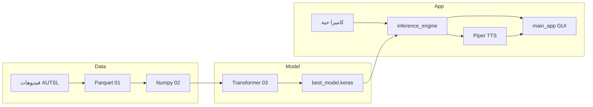

# دراسة شاملة لمشروع تحويل لغة الإشارة التركية (TİD) إلى نص وكلام

## 1. نظرة عامة على المشروع

المشروع يحوّل **لغة الإشارة التركية (TİD)** إلى نص وكلام مسموع في الوقت الفعلي باستخدام:

- **MediaPipe Holistic** لاستخراج نقاط الهيكل العظمي من الفيديو.
- **نموذج Transformer** مُدرَّب للتعرف على 226 إشارة (دقة ~90%).
- **محرك Piper TTS** لتحويل النص التركي إلى كلام.

الحالة الحالية: استخراج المعالم وتدريب النموذج مكتملان؛ التكامل (محرك الاستدلال، واجهة المستخدم، Piper) قيد التنفيذ.

---

## 2. الملفات والبنية

| الملف/المجلد                                                         | الوظيفة                                                                 |
| -------------------------------------------------------------------- | ----------------------------------------------------------------------- |
| [README.md](README.md)                                               | وصف المشروع، الهيكل، المهام المتبقية                                    |
| [completion_plan.md.resolved](completion_plan.md.resolved)           | خطة إكمال المشروع (المستشار الأكاديمي)                                  |
| [r.txt](r.txt)                                                       | روابط Piper (Hugging Face + GitHub)                                     |
| [01_TID_Landmark_Extraction.ipynb](01_TID_Landmark_Extraction.ipynb) | استخراج معالم MediaPipe من فيديوهات AUTSL                               |
| [02_TID_Pre_Processing.ipynb](02_TID_Pre_Processing.ipynb)           | تحويل Parquet إلى مصفوفات مُعدّة للتدريب                                |
| [03_TID_Model_Training.ipynb](03_TID_Model_Training.ipynb)           | بناء وتدريب نموذج Transformer وحفظه                                     |
| [best_model_transformer.keras](best_model_transformer.keras)         | نموذج Keras المُدرَّب (غير موجود في المستودع كملف؛ يُشار إليه في الكود) |
| [Piper/](Piper/)                                                     | سكربتات اختبار Piper + إعدادات الصوت التركي                             |

---

## 3. دفتر 01: استخراج المعالم (Landmark Extraction)

**الهدف:** استخراج إحداثيات (x,y,z) لمعالم MediaPipe Holistic من كل فيديوهات مجموعة **AUTSL** وحفظها كملفات Parquet مع إمكانية الاستئناف.

### 3.1 الاعتماديات والإعداد

- **الحزم:** `mediapipe==0.10.14`, `kagglehub`, `pyarrow`, `fastparquet`.
- **تشغيل:** Google Colab مع ربط Google Drive.
- **المخرجات:** مجلد `AUTSL_Full_Parquet` على Drive؛ كل فيديو → ملف `.parquet` واحد.

### 3.2 إعداد MediaPipe

- `FRAME_STRIDE = 1`: معالجة كل إطار (لا تخطي).
- `RESIZE_HEIGHT = 512`: تغيير حجم الإطار لثبات وسرعة.
- `MP_CONFIG`: Holistic بـ `model_complexity=1`, `refine_face_landmarks=True`, عتبات ثقة 0.5.

### 3.3 تحميل مجموعة البيانات

- **المصدر:** `kagglehub.dataset_download("sttaseen/autsl")`.
- **الملفات:** `train_labels.csv`, `val_labels.csv`, `test_labels.csv` (أعمدة: filename, label).
- **البحث عن الفيديو:** يبحث عن `{filename}.mp4` أو `{filename}_color.mp4` داخل مجلدات train/val/test.
- النتيجة: DataFrame واحد يجمع كل الصفوف مع عمود `path` و`subset` و`label`.

### 3.4 دالة الاستخراج `process_video_mediapipe`

- تفتح الفيديو بـ `cv2.VideoCapture`.
- لكل إطار (مع احترام `FRAME_STRIDE`):
  - تغيير حجم إلى 512×512.
  - تحويل BGR → RGB ومعالجة بـ `holistic.process(frame_rgb)`.
  - استخراج مسطح للإحداثيات:
    - **Pose:** 33 نقطة → مصفوفة مسطحة أو NaN عند الغياب.
    - **Left hand / Right hand / Face:** نفس الأسلوب.
- تُرجع قائمة من القواميس: كل عنصر = `{frame, pose, left_hand, right_hand, face}`.

### 3.5 الاستئناف والسجلات

- **الملفات:** `processing_status.json` (آخر حالة)، `extraction_history.csv` (سجل زمني)، `error_log.csv` (أخطاء).
- `get_processed_files()`: يمسح المجلد ويجمع أسماء ملفات `.parquet` الموجودة ويستبعدها من المعالجة.
- `update_log()`: يحدّث JSON ويزيد سطراً في CSV.
- `log_error()`: يضيف سطراً في `error_log.csv`.
- **استئناف الوقت:** إذا وُجد `processing_status.json` يُقرأ `elapsed_seconds` ويُطرح من `time.time()` لاحقاً لاستمرار العد الإجمالي.

### 3.6 الحلقة الرئيسية

- تشغيل Holistic مرة واحدة ثم التكرار على `df_remaining`.
- لكل فيديو: إنشاء المسار `OUTPUT_DIR/{subset}/{label}/{vid_id}.parquet`.
- إذا الملف موجود → تخطي (تجنب تكرار).
- استدعاء `process_video_mediapipe` ثم حفظ النتيجة كـ Parquet (pyarrow, snappy).
- تحديث السجلات كل 5 فيديوهات؛ استدعاء `gc.collect()` كل 50.

**ملاحظة:** بنية الحفظ في الدفتر الأول هي `{subset}/{label}/{filename}.parquet`، بينما الدفتر الثاني يفترض بنية أخرى مع CSV (path, participant_id, sequence_id, sign). لذا قد يكون هناك خطوة تحويل/إعادة تنظيم بين الدفترين حسب نسخة AUTSL المستخدمة.

---

## 4. دفتر 02: المعالجة المسبقة (Pre-Processing)

**الهدف:** تحويل Parquet (Long Format أو Wide حسب المصدر) إلى مصفوفات NumPy جاهزة للتدريب: شكل `(عينات, 80 إطاراً, 85 نقطة, 3)` ثم حفظ كـ `.npy`.

### 4.1 الإعداد

- **المدخلات:** مجلد يحتوي على Parquet + CSV (مثلاً من Kaggle: `AUSTL_processed_landmark`).
- **المخرجات:** `AUTSL_Full_Processed` مع `X_train.npy`, `y_train.npy` ونظائرها لـ val و test.
- **ثوابت:** `TARGET_FRAMES = 80`, `NUM_CLASSES = 225` (البيانات الفعلية أظهرت 226 صنفاً).

### 4.2 تحميل CSV والتحقق

- لكل split (train/val/test) يُقرأ CSV ويُفحص عدد الصفوف، الأعمدة، عدد الفئات، `participant_id`.
- مسار المثال: `train/0/1.parquet`؛ التسمية من عمود `sign` وليس من اسم المجلد.

### 4.3 اختيار المعالم (من 543 إلى 85)

- MediaPipe يعطي **543** نقطة (Pose + Face + Left hand + Right hand).
- يُحتفظ بـ **85** نقطة فقط:
  - **LIPS_IDXS0** (40 نقطة شفاه)، تُحوّل إلى indices عامة: `LIPS_GLOBAL = 33 + LIPS_IDXS0`.
  - **POSE_IDXS0**: [11, 12, 0] = يسار كتف، يمين كتف، أنف (مرجع).
  - **LH_GLOBAL** = 501–521 (21 نقطة يد يسرى).
  - **RH_GLOBAL** = 522–542 (21 نقطة يد يمنى).
- `KEEP_INDICES = concatenate(LH, RH, LIPS_GLOBAL, POSE_REF_GLOBAL)` → 85 مؤشراً.

### 4.4 كلاس FeatureGen

- **type_map:** انزياح النوع في الترقيم العالمي: pose=0, face=33, left_hand=501, right_hand=522.
- **read_parquet(path):**
  - يقرأ Parquet (أعمدة مثل frame, type, landmark_index, x, y, z).
  - يبني مصفوفة `(n_frames, 543, 3)` ويملأها حسب `type` و`landmark_index` (قد تكون قيم NaN حيث لا يوجد قياس).
- **smart_resize(x, target_frames=80):**
  - يستخدم `tf.image.resize` مع bilinear لضغط/تمديد البعد الزمني إلى 80 إطاراً.
- **preprocess(x):**
  1. اختيار النقاط: `x[:, KEEP_INDICES, :]` → (n_frames, 85, 3).
  2. معالجة NaN: تسطيح، إدراج خطي عبر المحور الزمني (pandas interpolate)، تعبئة المتبقي بـ 0.
  3. تطبيع مكاني:
    - الإزاحة بالنسبة للأنف: `x_filtered - nose[:, None, :]`.
    - القياس: قسمة على `norm(left_shoulder - right_shoulder)` لكل إطار (تجنب القسمة على صفر).
  4. تغيير الطول الزمني: `smart_resize(..., TARGET_FRAMES)` → الخرج (80, 85, 3).

### 4.5 بناء قائمة الملفات من CSV

- `build_file_list_from_csv(split, df_csv)`: لكل صف يبني المسار الكامل من `path` ويأخذ التسمية من `sign`؛ يُرجع قائمة (path, label) وعدد الملفات المفقودة.

### 4.6 معالجة وحفظ كل split

- **process_split:** لكل (path, label) يقرأ Parquet بـ `read_parquet`، يطبّق `preprocess`، يجمّع في قوائم ثم يحوّلها إلى `np.array` (float32) و`np.array` للتسميات (int32). يُرجع X, y, paths وأي أخطاء.
- **save_split:** يحفظ `X_{split}.npy`, `y_{split}.npy`, `metadata_{split}.csv`, واختيارياً `errors_{split}.csv`.

النتيجة: ملفات مثل `X_train.npy` بشكل (28130, 80, 85, 3) و`y_train.npy` (28130,) مع 226 صنفاً.

---

## 5. دفتر 03: تدريب النموذج (Model Training)

**الهدف:** تحميل الـ `.npy`، بناء Transformer Encoder للتصنيف، تدريبه مع Callbacks، وتقييمه وحفظ النموذج و LabelEncoder.

### 5.1 التهيئة والتحميل

- **INPUT_DIR:** مجلد مخرجات الدفتر 02 (مثلاً على Kaggle).
- **OUTPUT_DIR:** مجلد حفظ النموذج والسجلات.
- **ثوابت البيانات:** TARGET_FRAMES=80, NUM_POINTS=85, NUM_COORDS=3 → NUM_FEATURES=255.
- **ثوابت التدريب:** EPOCHS=200, BATCH_SIZE=256, LR_MAX=7e-4, WD_RATIO=5e-5, N_WARMUP_EPOCHS=15.
- تحميل X_train, y_train, X_val, y_val, X_test, y_test من الـ `.npy`.

### 5.2 تحضير البيانات

- **LabelEncoder:** يطبّق على y_train ثم transform على val و test؛ التحقق أن الفئات 0..N-1 متتالية (متوافقة مع sparse_categorical_crossentropy).
- **تسطيح المكان:** `X.reshape(N, 80, 255)` ثم حذف المصادر الأصلية (80, 85, 3) لتوفير الذاكرة.

### 5.3 مكونات النموذج

- **SparseCategoricalCrossentropyWithLS:** فرق مخصص يطبّق Label Smoothing (0.1) عبر تحويل التسميات إلى one-hot ثم تخفيفها قبل cross-entropy.
- **TransformerBlock:**
  - MultiHeadAttention (num_heads=8, key_dim=embed_dim).
  - FFN: Dense(ff_dim=768) → GELU → Dense(embed_dim).
  - LayerNorm + Residual قبل وبعد كل من Attention و FFN، مع Dropout (0.4).
- **PositionalEmbedding:** طبقة Embedding لمواضع 0..maxlen-1 تُضاف إلى الإدخال (تعلم موضع كل إطار).

### 5.4 دالة build_model

- **الإدخال:** (None, 80, 255).
- **Feature projection:** Dense(256) → (80, 256).
- **PositionalEmbedding(maxlen=80, embed_dim=256).**
- **3 × TransformerBlock(embed_dim=256, num_heads=8, ff_dim=768, dropout=0.4).**
- **GlobalAveragePooling1D** → (256,).
- **Dropout → Dense(256, gelu) → Dropout → Dense(226, softmax).**
- **الملخص:** ~7.7M معامل، كلها قابلة للتدريب.

### 5.5 التدريب

- **Optimizer:** AdamW(lr=LR_MAX, weight_decay=WD_RATIO, clipnorm=1.0).
- **Loss:** SparseCategoricalCrossentropyWithLS(num_classes=226, label_smoothing=0.1).
- **Callbacks:**
  - ModelCheckpoint: حفظ أفضل نموذج حسب `val_accuracy` في `best_model_transformer.keras`.
  - EarlyStopping: صبر 40 epoch على val_accuracy، استعادة أفضل الأوزان.
  - LearningRateScheduler: دالة `lrfn` — warmup خطي من 0 إلى LR_MAX على 15 epoch، ثم cosine decay إلى 0 حتى epoch 200.

التدريب يُنفَّذ على بيانات كبيرة (مثلاً ~28k عينة تدريب) ويصل إلى دقة تحقق عالية (يُذكر ~90% في README).

---

## 6. مجلد Piper وملفات TTS

### 6.1 الغرض

Piper محرك **Text-to-Speech** خفيف يعمل بنماذج ONNX. المشروع يستخدم صوتاً تركياً (tr_TR) من Hugging Face لتحويل النص المُعرَّف إلى كلام.

### 6.2 الملفات في Piper

- **tr_TR-dfki-medium.onnx.json:** وصف النموذج (Piper 1.2.0): sample_rate=22050، لغة tr_TR، phoneme_type=espeak، خريطة رموز صوتية، إعدادات inference (noise_scale, length_scale, noise_w).
- **piper_test_basic.py:** تحميل النموذج من مسار محلي (مثال: `tr_TR-dfki-medium.onnx`)، توليد كلام من جملة تركية، كتابة WAV بسيطة عبر `voice.synthesize_wav(text, wav_file)`.
- **piper_test_config.py:** نفس الفكرة مع `SynthesisConfig` (مثل length_scale=1.5 للبطء، volume، noise_scale) وتمريرها كـ `syn_config`.
- **piper_test_stream.py:** استخدام الوضع الدفق: `voice.synthesize(text)` يُرجع مكرراً لـ chunks؛ ضبط معلمات WAV من أول chunk ثم كتابة `audio_int16_bytes` أو `audio_bytes` في الملف.

**ملاحظة:** المسارات في السكربتات تشير إلى مسار مستخدم آخر (مثل `c:\Users\ISMAIL YAHYA\...`). للتشغيل على جهازك يجب تغيير `model_path` إلى مسار مجلد Piper أو مكان تحميل `tr_TR-dfki-medium.onnx` وملف الـ JSON.

### 6.3 ملف r.txt

يحتوي روابط:

- Hugging Face لصوت tr_TR/dfki/medium.
- مستودع Piper (OHF-Voice/piper1-gpl).

---

## 7. README و completion_plan

### 7.1 README.md

- يلخص المشروع والحالة (Landmark ✅، Model ✅، TTS مُعدّ، Integration قيد العمل).
- يوضح الهيكل: الدفاتر الثلاثة، مجلد Piper، ملف النموذج.
- يقترح تقسيم العمل: **Task A** inference_engine.py (تحميل النموذج، تنبؤ، نافذة منزاحة)، **Task B** voice_controller.py (واجهة Piper، speak دون حظر)، **Task C** main_app.py (واجهة سطح مكتب، كاميرا، تاريخ).
- يشير إلى متطلبات أكاديمية: سجل التدريب، الفصلين 5 و6 من الرسالة، العرض التقديمي.

### 7.2 completion_plan.md.resolved

- **المرحلة 1 (تقني):** سكربت استدلال موحّد (تحميل النموذج + Piper)، حلقة تعرف مباشر مع buffer (مثلاً 30–60 إطار)، تكامل Piper مع منطق debounce لتجنب تكرار نطق نفس الكلمة.
- **المرحلة 2 (تطبيق):** تطبيق سطح مكتب (PyQt6 أو Tkinter) مع بث كاميرا حي، تراكب معالم، عرض النص المُعرَّف، زر/وضع "تحدث"، سجل تاريخ.
- **المرحلة 3 (أكاديمي):** سجل التدريب اليومي، إكمال نتائج ومناقشة الرسالة (مصفوفات ارتباك، مقارنة مع أدبيات)، الخلاصة والمراجع.
- جدول زمني مقترح على 4 أسابيع وجزء "نصائح للمستشار" (مثل ذكر المعالم غير اليدوية، تحليل الأخطاء، اقتراحات تصحيح بسيطة).

---

## 8. تدفق البيانات من البداية للنهاية

---

## 9. ملخص تقني سريع

| البند                 | التفاصيل                                                                |
| --------------------- | ----------------------------------------------------------------------- |
| مجموعة البيانات       | AUTSL، 226 صنفاً، عشرات آلاف الفيديوهات (train/val/test)                |
| المعالم               | 543 → 85 (يدان + شفاه + 3 مراجع جسم)، إحداثيات x,y,z                    |
| الشكل النهائي للتدريب | (N, 80, 255): 80 إطار، 255 = 85×3                                       |
| النموذج               | Transformer Encoder: embed 256، 8 heads، 3 blocks، FFN 768، dropout 0.4 |
| الخسارة               | Sparse Categorical Crossentropy + Label Smoothing 0.1                   |
| التحسين               | AdamW، cosine decay + warmup 15 epoch، clipnorm 1.0                     |
| TTS                   | Piper، صوت tr_TR-dfki-medium، استخدام عبر Python مع WAV أو streaming    |

هذه الدراسة تغطي كل ملف مطلوب سطراً وسياقاً، ويمكن استخدامها كأساس لوثيقة المشروع أو الرسالة أو خطة التنفيذ القادمة.