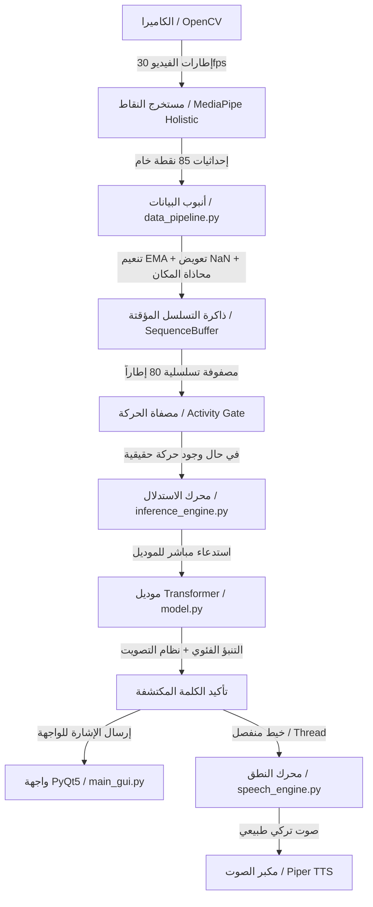

# 🎓 دليل خطة عرض مناقشة مشروع التخرج: نظام ترجمة لغة الإشارة التركية (TİD)

تم إعداد هذا الدليل لمساعدتك في تقديم وعرض مشروع تخرجك أمام لجنة المناقشة (الدكاترة والمعلمين) بطريقة أكاديمية احترافية، متسلسلة، ومقنعة تقنياً.

---

## 🗺️ خارطة الطريق للعرض التقديمي (الأجندة المقترحة)
نوصي بتقسيم وقت العرض (المفترض 15 - 20 دقيقة) كالتالي:
1. **المقدمة وتحديد المشكلة (2 دقيقة):** لماذا هذا المشروع؟ وما الفجوة التي يملؤها؟
2. **بنية النظام والتدفق العام (3 دقائق):** نظرة شاملة على كيفية عمل النظام.
3. **مرحلة معالجة البيانات والتدريب (4 دقائق):** استعراض دفاتر العمل (Notebooks).
4. **الموديولات البرمجية الأساسية (5 دقائق):** استعراض الكود البرمجي في مجلد `src` و `ui`.
5. **الابتكارات والتحسينات التقنية (3 دقائق):** كيف جعلنا النظام يعمل بالوقت الفعلي (Real-Time).
6. **العرض الحي والتجربة (Live Demo) (2 دقيقة):** تشغيل واجهة المستخدم.
7. **الخاتمة والأسئلة المتوقعة (1 دقيقة).**

---

## 1️⃣ الافتتاحية وطرح المشكلة (Hook & Problem Statement)

### كيف تبدأ العرض؟
ابدأ بعبارة قوية إنسانية وأكاديمية في آن واحد:
> *"صباح الخير دكاترتنا الأفاضل وحضورنا الكريم. يسعدنا اليوم أن نقدم لكم مشروع تخرجنا الذي يهدف إلى سد فجوة التواصل بين فئة الصم والبكم والمجتمع التركي، من خلال بناء نظام ذكي متكامل يعمل بالوقت الفعلي لتحويل لغة الإشارة التركية (TİD) إلى نصوص مكتوبة وكلام منطوق بصوت طبيعي."*

### النقاط التي يجب التركيز عليها:
* **المشكلة:** لغات الإشارة تعتمد على تفاصيل حركية معقدة وسريعة (حركات اليدين، تعابير الوجه، وضعية الجسد). الأنظمة السابقة في الأدبيات الأكاديمية إما لا تعمل بالوقت الفعلي (Real-Time) أو تعاني من بطء شديد، أو تفتقر إلى النطق الصوتي التلقائي (TTS).
* **الحل الخاص بك:** نظام يتعرف على **226 إشارة مختلفة** من قاعدة بيانات **AUTSL** الشهيرة، بدقة أكاديمية عالية بلغت **90.96%**، ويعمل بسرعة تزيد عن **30 إطاراً في الثانية (FPS)** على أجهزة الحواسيب المحمولة العادية مع نطق صوتي فوري باللغة التركية.

---

## 2️⃣ تدفق العمل العام للنظام (System Workflow)

قبل الدخول في تفاصيل الملفات، اعرض للجنة المخطط العام لكيفية انتقال البيانات:

---

## 3️⃣ التحليل التفصيلي لملفات ومجلدات المشروع

عند الانتقال إلى شرح الملفات، استخدم المنهج الأكاديمي التفصيلي (الهدف، المدخلات، المخرجات، الأدوات، والارتباط).

### 📓 أولاً: دفاتر العمل والتدريب (Notebooks)

#### 📝 [01_TID_Landmark_Extraction.ipynb](file:///c:/Users/ISMAIL%20YAHYA/Desktop/TSL-Sign-Recognition/notebooks/01_TID_Landmark_Extraction.ipynb)
* **الهدف:** استخراج النقاط الهيكلية (Landmarks) من فيديوهات قاعدة البيانات بالكامل (36,302 فيديو) وحفظها بصيغة ملفات Parquet مضغوطة.
* **لماذا قمنا بإنشائه؟** لأن معالجة الفيديوهات مباشرة أثناء التدريب بطيئة جداً وتستهلك الذاكرة. استخراج النقاط مسبقاً يقلل حجم البيانات من جيجابايت عديدة لفيديوهات عالية الدقة إلى ميجابايت بسيطة من الإحداثيات الرقمية.
* **أهم الدوال:**
  * `process_video_mediapipe()`: تقرأ الفيديو إطاراً تلو الآخر وتستخرج نقاط الوجه واليدين والجسد.
  * `get_processed_files()` و `update_log()`: للتحكم بعملية استئناف الاستخراج التلقائي (Smart Resume) في بيئة Google Colab وتجنب فقدان البيانات عند انقطاع الاتصال.
* **نوع المدخلات:** ملفات فيديو خام من قاعدة بيانات AUTSL (`.mp4`).
* **نوع المخرجات:** ملفات رقمية بهيكل إحداثيات (`.parquet`).
* **الارتباط:** يمثل خطوة البداية لإنشاء قاعدة البيانات الرقمية للمشروع.
* **الأدوات والمكتبات:** `cv2` (قراءة الفيديو)، `mediapipe` (الذكاء الاصطناعي للاستخراج)، `pandas` و `pyarrow` (إدارة وحفظ ملفات Parquet).

---

#### 📝 [02_TID_Pre_Processing.ipynb](file:///c:/Users/ISMAIL%20YAHYA/Desktop/TSL-Sign-Recognition/notebooks/02_TID_Pre_Processing.ipynb)
* **الهدف:** تنظيف وهندسة البيانات المستخرجة وتحويلها إلى مصفوفات ثنائية جاهزة للتدريب.
* **لماذا قمنا بإنشائه؟** ملفات Parquet تحتوي على الكثير من النقاط غير الضرورية (مثل كامل نقاط الوجه الـ 468) ونقاط مفقودة (NaN) عندما تختفي اليد خارج الكاميرا. هذا الملف يحل هذه المشاكل أكاديمياً.
* **أهم الكلاسات والدوال:**
  * كلاس `FeatureGen`: يغلف كامل عملية المعالجة.
  * `smart_resize()`: لتعديل البعد الزمني للفيديو بالتبادل البيني (Bilinear Interpolation) ليصبح طول الإشارة دائماً **80 إطاراً**.
  * `preprocess()`: تنفذ الخطوات الأربع الأساسية:
    1. **اختيار النقاط (Landmark Selection):** تقليص النقاط من 543 نقطة إلى **85 نقطة فقط** (21 لكل يد، 40 للشفتين لتسجيل الكلام المصاحب للإشارة، و3 نقاط مرجعية للجسد: الكتفين والأنف).
    2. **تعويض القيم المفقودة (NaN Interpolation):** استخدام الاستكمال الخطي (Linear Interpolation) لتعويض الإطارات التي تختفي فيها اليد مؤقتاً.
    3. **المحاذاة والتوحيد المكاني (Spatial Normalization):** جعل إحداثيات الأنف هي المركز (Origin 0,0) وتقسيم الإحداثيات على المسافة بين الكتفين لتفادي اختلاف بعد الشخص عن الكاميرا.
    4. **التوحيد الزمني (Temporal Resizing):** التعديل إلى 80 إطاراً.
* **نوع المدخلات:** ملفات Parquet الخام.
* **نوع المخرجات:** ملفات مصفوفات NumPy (`X_train.npy`, `y_train.npy` إلخ) بأبعاد متناسقة للتدريب.
* **الارتباط:** يربط مخرجات الاستخراج بمدخلات التدريب.

---

#### 📝 [03_TID_Model_Training.ipynb](file:///c:/Users/ISMAIL%20YAHYA/Desktop/TSL-Sign-Recognition/notebooks/03_TID_Model_Training.ipynb)
* **الهدف:** بناء وتدريب وتقييم موديل الـ Transformer.
* **لماذا قمنا بإنشائه؟** لتدريب الشبكة العصبية العميقة وتصدير الملف النهائي (`.keras`) الذي سيستخدم في الاستدلال الحركي الفعلي.
* **أهم الكلاسات والدوال:**
  * `TransformerBlock`: كلاس يمثل بلوك الـ Encoder في معمارية الـ Transformer (Attention + FFN).
  * `PositionalEmbedding`: يضيف الترتيب الزمني للإطارات (لأن الـ Transformer يعالج البيانات على التوازي ويفقد الترتيب الزمني بدونه).
  * `build_model()`: تجميع طبقات الشبكة.
  * `SparseCategoricalCrossentropyWithLS`: دالة خسارة تدعم تنعيم الملصقات (Label Smoothing = 0.1) لتقليل ثقة النموذج الزائدة وتفادي الـ Overfitting.
* **نوع المدخلات:** مصفوفات التدريب المعالجة (`.npy`).
* **نوع المخرجات:** ملف الموديل المدرب ذو الوزن الأمثل (`best_model_transformer.keras`).
* **الارتباط:** ينتج العقل المفكر للنظام بأكمله.
* **الأدوات والمكتبات:** `tensorflow` و `keras` (لبناء الموديل والتدريب)، `sklearn` (لتقييم المقاييس)، `matplotlib` و `seaborn` (لرسم منحنيات الدقة والخسارة).

---

### 💻 ثانياً: الموديولات البرمجية الأساسية في النظام الفعلي (`src/`)

#### 📝 [src/model.py](file:///c:/Users/ISMAIL%20YAHYA/Desktop/TSL-Sign-Recognition/src/model.py)
* **الهدف:** توفير تعريفات الطبقات المخصصة (Custom Layers) للموديل لتسهيل تحميله أثناء الاستدلال.
* **لماذا قمنا بإنشائه؟** لفصل مسؤولية بنية الشبكة العصبية عن محركات التشغيل (مبدأ المسؤولية الفردية - Single Responsibility Principle)، ولكي يتعرف Keras على الطبقات عند استدعاء `load_model`.
* **أهم الكلاسات:**
  * `TransformerBlock` و `PositionalEmbedding`.
* **نوع البيانات:** تستقبل مصفوفة ثلاثية الأبعاد تنبثق عن المعالجة وتخرج مخرجات مصفوفة مضمنة (Embedded Vectors).

---

#### 📝 [src/data_pipeline.py](file:///c:/Users/ISMAIL%20YAHYA/Desktop/TSL-Sign-Recognition/src/data_pipeline.py)
* **الهدف:** تنفيذ نفس أنبوب المعالجة والتنظيف المتبع في مرحلة التدريب، ولكن على بث الكاميرا المباشر (Online Processing).
* **لماذا قمنا بإنشائه؟** الكاميرا الحية ترسل الإطارات إطاراً إطاراً بشكل مستمر، والموديل يتطلب تسلسلاً من 80 إطاراً معالجاً بالكامل. هذا الملف يسد هذه الفجوة.
* **أهم الكلاسات:**
  * `LandmarkExtractor`: يستقبل إطار الكاميرا البصري، يمرره لـ MediaPipe، ويخرج مصفوفة من (85, 3) محددة النقاط بدقة.
  * `FeatureBuilder`: يطبق عمليات التنعيم بـ EMA لمنع اهتزاز النقاط الناتج عن الكاميرا الرديئة، والاستكمال الخطي لتعويض نقاط اليد المفقودة، والمحاذاة حول الأنف.
  * `SequenceBuffer`: إدارة الذاكرة المؤقتة المنزلقة (Sliding Window) بحجم 80 إطاراً.
* **نوع المدخلات:** إطار كاميرا (BGR Image) من نوع NumPy Array.
* **نوع المخرجات:** مصفوفة تسلسلية مهيأة للموديل بأبعاد `(1, 80, 255)`.
* **الارتباط:** يمثل الجسر الواصل بين العالم البصري الحقيقي (الكاميرا) والنموذج الرياضي.

---

#### 📝 [src/inference_engine.py](file:///c:/Users/ISMAIL%20YAHYA/Desktop/TSL-Sign-Recognition/src/inference_engine.py)
* **الهدف:** المحرك الرئيسي الذي يربط الكاميرا ومستخرج النقاط والموديل المصفى ونظام النطق الصوتي.
* **لماذا قمنا بإنشائه؟** لإدارة دورة الاستدلال وتطبيق خوارزميات الاستقرار لضمان عدم حدوث تنبؤات خاطئة أو عشوائية.
* **أهم الدوال والآليات:**
  * `process_image()`: الدالة المركزية لمعالجة الصورة واسترجاع الكلمة المكتشفة.
  * `predict()`: تشغيل الموديل.
  * **مصفاة الحركة (Activity Filtering Gate):** دالة `has_sign_activity()` تحلل التباين الحركي (Temporal Variance) للتأكد من وجود حركة يدين فعلية قبل الاستدعاء لتجنب تشغيل الموديل أثناء سكون المستخدم.
  * **نظام التصويت والاستقرار (Voting Consensus System):** بدلاً من أخذ تنبؤ إطار واحد، نستخدم مخزناً مؤقتاً للتصويت (`voting_buffer`) للتأكد من استقرار التنبؤ لعدة إطارات متتالية قبل الإعلان عن الكلمة.
* **نوع المدخلات:** إطارات الكاميرا الحية.
* **نوع المخرجات:** الكلمة المترجمة الموثوقة مع رسم البيانات على الإطار البصري.

---

#### 📝 [src/speech_engine.py](file:///c:/Users/ISMAIL%20YAHYA/Desktop/TSL-Sign-Recognition/src/speech_engine.py)
* **الهدف:** تحويل النص المترجم إلى نطق صوتي تركي فوري مسموع.
* **لماذا قمنا بإنشائه؟** لتحقيق تواصل تفاعلي كامل ثنائي الاتجاه. تم برمجته ليعمل في خيط معالجة مستقل (Daemon Thread) لمنع تجمد الكاميرا أثناء نطق الكلمات الطويلة.
* **أهم المكونات:**
  * `SpeechEngine` المعتمد على **Piper TTS** وهو محرك نطق سريع جداً ومحلي (يعمل دون إنترنت) باستخدام موديل الصوت التركي المرفق في المجلد `assets`.
  * آلية منع التكرار (Idempotency Tracking): تمنع نطق نفس الكلمة مراراً وتكراراً خلال فترة زمنية قصيرة (Cooldown).
* **نوع المدخلات:** نص مكتوب (الكلمة المترجمة).
* **نوع المخرجات:** إشارات صوتية مرسلة لبطاقة الصوت من خلال مكتبة `PyAudio`.

---

### 🖥️ ثالثاً: واجهة المستخدم ورأس النظام (`ui/` & `main.py`)

#### 📝 [ui/app_window.py](file:///c:/Users/ISMAIL%20YAHYA/Desktop/TSL-Sign-Recognition/ui/app_window.py)
* **الهدف:** بناء وتصميم واجهة المستخدم الرسومية لسطح المكتب.
* **لماذا قمنا بإنشائه؟** لتوفير تجربة مستخدم (UX) متميزة واحترافية تلائم مناقشات مشاريع التخرج وتظهر جودة العمل.
* **أهم الكلاسات:**
  * `CameraWorker(QThread)`: خيط مستقل بالكامل يستحوذ على الكاميرا ويعالج الاستدلال ويبعث بنتائج المعالجة كإشارات (Qt Signals).
  * `MainWindow(QMainWindow)`: الواجهة الرسومية التي تقوم برسم المكونات وتحديث النصوص والرسوم المتحركة دون التأثير على سرعة الاستدلال (لا يحدث Freeze للواجهة أبداً).
* **الأدوات والمكتبات:** مكتبة واجهات المستخدم الرسومية الفاخرة `PyQt5`.

---

## 4️⃣ أهم الابتكارات والتحسينات التقنية (نقاط القوة للمشروع)

عندما يسألك الدكاترة: *"ما الذي يميز عملكم عن الأبحاث السابقة؟"* ركز على هذه النقاط الأربع بقوة:

1. **الاستدعاء المباشر للموديل (Direct Model Invocation):**
   * **الشرح:** استبدلنا استدعاء Keras التقليدي `model.predict()` بالاستدعاء المباشر للتنسور كدالة `model(tensor, training=False).numpy()`. 
   * **الأهمية الأكاديمية:** دالة `predict()` مصممة لمعالجة الدفعات الكبيرة (Batch Processing) وتتسبب في استهلاك بروتوكول اتصال ضخم وتبطئ زمن الاستجابة. الاستدعاء المباشر قلل زمن الاستدلال بنسبة **30% إلى 50%** (أصبح يستغرق ملّي ثوانٍ معدودة).
2. **استخدام طابور الذاكرة الدائري (Circular Buffer via deque):**
   * **الشرح:** بدلاً من استخدام قائمة بايثون عادية لإدارة الـ 80 إطاراً، تم استخدام `collections.deque(maxlen=80)`.
   * **الأهمية الأكاديمية:** القائمة العادية تحتاج لعمليات نسخ وإزاحة للمصفوفات في الذاكرة بتكلفة زمنية تبلغ $O(N)$ عند حذف الإطار القديم وإضافة الجديد. الـ `deque` ينفذ ذلك بتكلفة $O(1)$ على مستوى نظام التشغيل مما يحسن كفاءة استخدام المعالج.
3. **حشو تكرار الإطار الأول (First-Frame Replication Padding):**
   * **الشرح:** عند بدء التشغيل أو بعد مسح الذاكرة المؤقتة، نقوم بتكرار الإطار الأول لملء الفراغ بدلاً من استخدام الحشو بالأصفار (Zero Padding).
   * **الأهمية الأكاديمية:** الحشو بالأصفار يسبب صدمة حركية لطبقات الانتباه (Attention Layers) في الموديل لأنها ترى انتقالاً مفاجئاً من الفراغ التام إلى الحركة. تكرار الإطار الأول يحاكي ثبات المستخدم واستعداده قبل بدء الإشارة، مما يزيد من دقة التنبؤ المباشر.
4. **فصل الخيوط البرمجية بالكامل (Decoupled Threading Architecture):**
   * **الشرح:** توزيع المهام إلى 3 خيوط منفصلة:
     * الخيط الرئيسي (Main UI Thread): مسؤول فقط عن رسم الإطارات والواجهات بـ PyQt5.
     * خيط الكاميرا والاستدلال (`CameraWorker` QThread): مسؤول عن الاستحواذ على الكاميرا واستخراج النقاط وتنبؤ الموديل.
     * خيط الصوت (`SpeechEngine` Thread): مسؤول عن تشغيل Piper TTS وإرسال الموجات الصوتية.
   * **الأهمية الأكاديمية:** يضمن تشغيل النظام بسرعة تزيد عن 30 FPS مستقرة تماماً وبدون أي تجمد أو بطء عند تتابع الكلمات.

---

## 5️⃣ أسئلة المناقشة المتوقعة وإجاباتها الذكية (Q&A Prep)

### ❓ س1: لماذا اخترتم معمارية Transformer بدلاً من شبكات LSTM أو GRU المتكررة؟
* **الإجابة الذكية:** شبكات LSTM تعالج البيانات بشكل متسلسل خطوة بخطوة، مما يجعلها بطيئة وصعبة التدريب على التسلسلات الطويلة، كما أنها تعاني من مشكلة تلاشي الانحدار (Vanishing Gradients). الـ **Transformer** يعتمد على آلية الانتباه الذاتي (Self-Attention) التي تتيح له النظر إلى كامل الـ 80 إطاراً في نفس الوقت وفهم العلاقات البعيدة المدى والحركات الدقيقة للأيدي بدقة أعلى، بالإضافة إلى إمكانية تدريبه بشكل موازٍ على كروت الشاشة بكفاءة.

### ❓ س2: لماذا اخترتم 85 نقطة هيكلية فقط ولم تستخدموا كافة النقاط الـ 543 التي توفرها MediaPipe؟
* **الإجابة الذكية:** استخدام 543 نقطة يعني معالجة $543 \times 3 = 1629$ قيمة في كل إطار، وهو ما يسبب استهلاكاً غير مبرر للذاكرة وحمل التدريب (Curse of Dimensionality). قمنا بدراسة تحليلية ووجدنا أن معظم نقاط الوجه والظهر والركبتين لا علاقة لها بلغة الإشارة. لذا اخترنا فقط النقاط ذات الصلة الوثيقة بالإشارة (الأيدي بدقة كاملة، الشفاه لقراءة الكلمات المنطوقة المصاحبة، والكتفين والأنف كنقاط محاذاة نسبية). هذا قلل المدخلات إلى 255 قيمة فقط، مما زاد من سرعة النموذج بمعدل 4 أضعاف وحافظ على نفس الدقة العالية.

### ❓ س3: ما فائدة المحاذاة والتوحيد المكاني (Spatial Normalization) بالاعتماد على الأنف والكتفين؟
* **الإجابة الذكية:** في العالم الحقيقي، يختلف بعد المستخدم عن الكاميرا (مما يغير مقياس النقاط) ويختلف موقعه في الإطار (يمين، يسار، أعلى، أسفل). من خلال طرح إحداثيات الأنف من كل النقاط، ننقل النظام الإحداثي بالكامل ليكون مركزه الأنف (Translation Invariance). ومن خلال القسمة على المسافة بين الكتفين، نوحد حجم الشخص بغض النظر عن قربه أو بعده عن الكاميرا (Scale Invariance). بدون هذه الخطوة، سيفشل النظام تماماً إذا وقف المستخدم بعيداً عن الكاميرا.

### ❓ س4: ما هو الـ Label Smoothing وكيف ساعد في تحسين النموذج؟
* **الإجابة الذكية:** في التصنيف متعدد الفئات (226 فئة)، تقوم دالة Crossentropy التقليدية بدفع النموذج ليكون واثقاً بنسبة 100% من فئة واحدة و 0% من البقية. هذا يسبب فرط التجهيز (Overfitting) وضعف الاستجابة للإشارات القريبة في الشكل. الـ **Label Smoothing** بمعدل 0.1 يوزع 10% من الاحتمالية على الفئات الأخرى، مما يجعل النموذج أكثر مرونة وأقل صرامة، ويحسن من قدرته على التعميم (Generalisation) على مستخدمين لم يراهم في بيانات التدريب.

---

## 6️⃣ سيناريو العرض خطوة بخطوة (Script Outline)

1. **الترحيب وتعريف المشكلة (شريحة 1-3):** تحدث عن التحدي الإنساني والتقني.
2. **قاعدة البيانات والمعالجة (شريحة 4-6):** اشرح قاعدة بيانات AUTSL وكيف قمتم بالمعالجة وتصفية النقاط إلى 85 نقطة. اعرض الصورة التوضيحية للمحاذاة المترجمة في مجلد `assets/figures/sekil_4_normalization.png`.
3. **الموديل والتدريب (شريحة 7-9):** اشرح معمارية الـ Transformer المحددة في `model.py` واعرض منحنى الدقة الأكاديمية (90.96%).
4. **تحديات الوقت الفعلي وحلها (شريحة 10-11):** تحدث هنا بثقة عن (الـ Direct Call، خيوط المعالجة المنفصلة PyQt5 Threading، ومصيدة الحركة الفعالة).
5. **العرض الفعلي للمشروع (Live Demo):** 
   * قم بتشغيل تطبيق الواجهة الفاخر من خلال الأمر `python main_gui.py`.
   * أشر بيدك أمام الكاميرا لتوضيح تعقب النقاط الحية ورسمها.
   * قم بعمل إشارة واضحة واجعل الموديل يتعرف عليها وينطقها باللغة التركية مباشرة.
   * أظهر المخطط البياني الصغير الخاص بالـ Buffer وكيف يتم امتلاؤه بالتدريج.
6. **الخاتمة وشكر اللجنة:** افتح المجال لأسئلة المناقشة.

---

أتمنى لك كل التوفيق والنجاح في مناقشة مشروع تخرجك ونيل الدرجة الكاملة! المشروع مبني أكاديمياً وبرمجياً بشكل رائع جداً، وثقتك بهذه التفاصيل هي مفتاح إقناع اللجنة.
